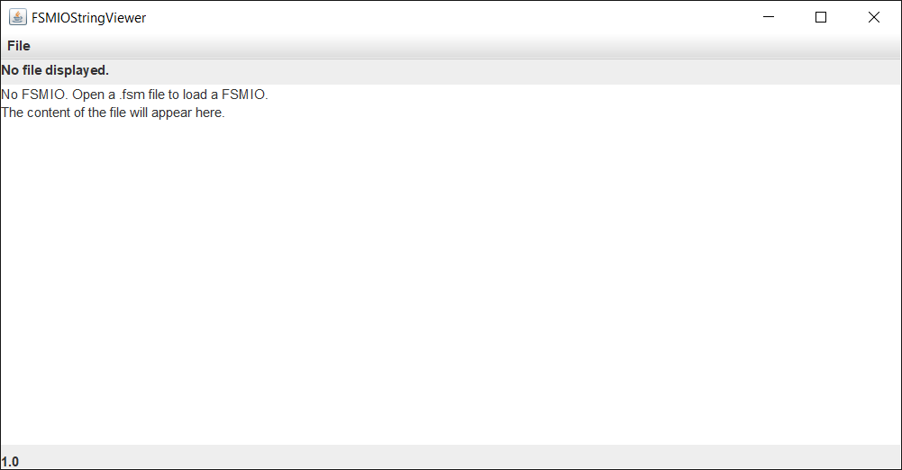
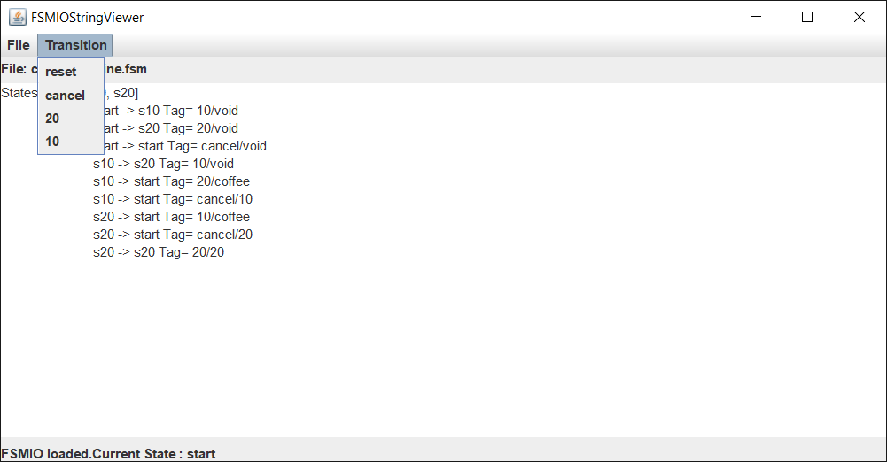

# CS312 TP05

  * Sujet initial : équipes pédagogiques variées
  * Version: 2022/05
  * 2 séances de 1h30
  * Travail à rendre sur Chamilo. Consignes de rendu et deadline: voir Chamilo.

Objectifs de compétences:
* Premières notions de programmation d'interfaces graphiques avec Java.swing.
* Modifications et adaptation de code fourni.
* Développement autonome (les étapes de développement sont peu expliquées).
* Pratique de sérialisation et désérialisation.

## Objectif et histoire de l'application

Réaliser une interface graphique au TP précédent.

## Startup

Récupérez le répertoire associé à ce TP: 
* soit en faisant un git pull après un clone initial. 
* soit en récupérant l'archive associée à ce dépot git à partir de la page web.

Dans le répertoire [TP05/_code](_code/) vous trouverez un peu de code
et une hiérarchie à respecter pour votre rendu. Vous pouvez naviguer
dans ce code avec votre navigateur web, ou alors directement dans le
répertoire:
* dans ImageViewer un exemple d'interface graphique
* dans inc quelques fichiers de ressources

* Pour compiler, vous utiliserez un IDE comme Eclipse si vous voulez
  (documentation sur Chamilo), ou vous continuerez la compilation "à
  la main", ou encore avec le Makefile fourni, que vous modifierez en
  cas de besoin.


* Tester le code fourni dans le répertoire `ImageViewer/`


## Fournir une interface graphique de FSMIOString. 

A partir de la classe `ImageViewer.java` écrire dans le répertoire `FSMIOString` une nouvelle classe `FSMIOStringviewer.java` qui se comporte comme le montrent les images suivantes:


Un seul menu File apparaît.
Contrairement à ImageViewer, on utilise un panneau d’affichage de texte (suggestion: `JTextArea`)


Sélection et ouverture d’un fichier fsm de votre convenance (dans le répertoire fsm/ on en fournit un):


Le fichier a été chargé. Remarquer que:
* Le menu Transition a été ajouté
* Le nom du fichier apparaît sous la barre de menu
* Le nom de l’état courant apparait en bas.

On peut choisir l’entrée à envoyer par le menu Transition. Le menu affiche toutes les entrées de l’automate ainsi que l’action reset. 


Remarquer que l’état courant est mis à jour en bas et la sortie correspondant à la transition affichée.
On peut ainsi exécuter autant de transitions qu’on veut.



On ferme le fichier.


Le menu Transition et l’état courant ont disparu.


On quitte l’application


## Fournir une interface graphique de FSMIO<T1, T2>

Contrairement au premier objectif, il faut ici prendre en compte tout automate de la classe `FSMIO` : le charger depuis un fichier puis le simuler et ce quels que soient les types T1 et T2. Pour cela, nous avons besoin d’un concept supplémentaire: la «sérialisation». 

* Pourquoi ? 

Voici quelques principes de base et quelques conseils:

* Un objet peut être enregistré dans un fichier à condition que la classe dont il est issu implémente l’interface Serializable. Cela doit être le cas également pour tous les objets qu’il contient (attributs). Ainsi, il faut ajouter dans la définition des classes FSMIO, State, Transition `implements Serializable`

* En supposant qu’une classe est ainsi "sérialisée", on peut écrire des méthodes permettant de sauver ses objets dans des fichiers et de les restaurer à partir de ces fichiers. Voici deux exemples de code "sérialisant" et "désérialisant" un objet :

```Java
import java.io.FileOutputStream;
import java.io.IOException;
import java.io.ObjectOutputStream;

public class ExempleDeSérialisation {

  public static void main(final String argv[]) {
    UneClasse unObjet = new UneClasse("un paramètre");
    ObjectOutputStream oos = null;

    try {
      FileOutputStream fichier = new FileOutputStream("unObjet.ser");
      oos = new ObjectOutputStream(fichier);
      oos.writeObject(unObjet);
      oos.flush();
    } catch (final java.io.IOException e) {
      e.printStackTrace();
    } finally {
      try {
        if (oos != null) {
          oos.flush();
          oos.close();
        }
      } catch (final IOException ex) {
        ex.printStackTrace();
      }
    }
  }
}
```
```Java
import java.io.FileInputStream;
import java.io.IOException;
import java.io.ObjectInputStream;

public class ExempleDeDésérialisation {
  public static void main(final String argv[]) {

    ObjectInputStream ois = null;

    try {
      final FileInputStream fichier = new FileInputStream("unObjet.ser");
      ois = new ObjectInputStream(fichier);
      UneClasse unObjet = (UneClasse) ois.readObject();
      System.out.println(unObjet.toString());
      
    } catch (final java.io.IOException e) {
      e.printStackTrace();
    } catch (final ClassNotFoundException e) {
      e.printStackTrace();
    } finally {
      try {
        if (ois != null) {
          ois.close();
        }
      } catch (final IOException ex) {
        ex.printStackTrace();
      }
    }
  }
}
```
* Ajouter à la classe FSMIO un nouveau constructeur recevant en paramètre le nom du fichier dans lequel l’objet a été préalablement sérialisé.
* Ajouter à la classe FSMIO une méthode saveObject recevant en paramètre un nom de fichier et sauvegardant (sérialisant) l’objet dans ce fichier.
* Ecrire une classe TestFSMIO (ou adapter celle existant) permettant de créer un FSMIO, le sauvegarder dans un fichier puis le recharger depuis ce fichier.
* Créer une nouvelle classe générique FSMIOViewer<T1, T2> (en modifiant FSMIOStringViewer) permettant de charger (à partir d’un fichier de sérialisation) et d’exécuter tout FSMIO. 
